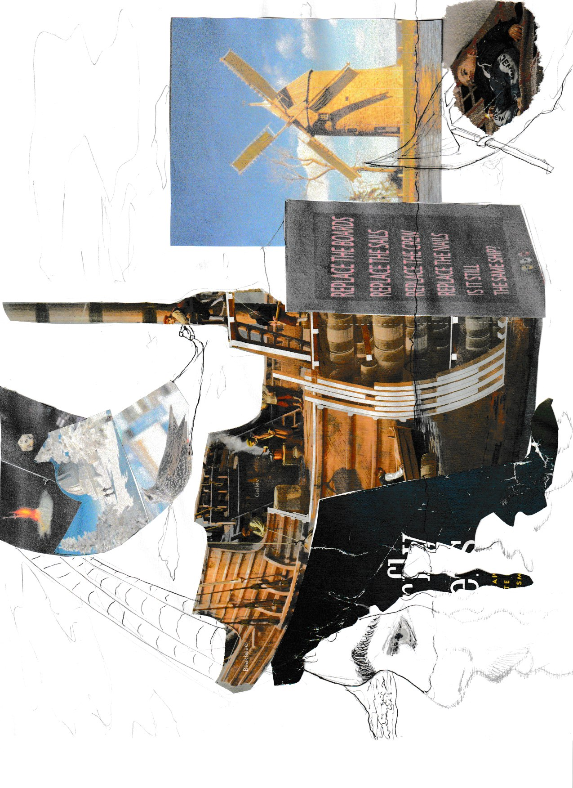

# CART253 : Computers aren't alien, they have language, so listen.

Learning how computers really work is useful on a number of levels I can't even begin to emphasize. The problem is, it's quite daunting to take on a seemingly impossible task. Nevertheless, it seems to me the task is indeed necessary to uphold in today's world, therefore I shall. With great help. But I shall.

This will essentially be a compilation of various projects and prototypes from the beginning of my computation days in Creative Computation at Concordia.

# Active journal: 
[Journal](https://nicoreganono.github.io/cart253/journal)

While self explanatory, this journal will have active updates to new projects, what I've learned and struggled with.

## What had been done:

[Portfolio](https://nicofou6.wixsite.com/portfolio2026)

This is, as the link suggest, my portfolio, done in early 2026. It compiles a lot of my best/favourite work and previous school projects, which allowed me to be admitted into concordia and CART253 in the first place!

[Instagram art dump](https://www.instagram.com/nicolartistic?fbclid=PAcGRvZgJleHRuA2FlbQIxMQBzcnRjBmFwcF9pZA85MzY2MTk3NDMzOTI0NTkAAac4Vw6cVegBkPB75jAguDTkm7DCcR_sdWqc7iWvo91wNcLMOX1fNd7qxY1y7g_aem_oRrgki3z-03_g16knSIL_w)

My fairly innactive art dump. It's unfortunate drawing isn't a habbit for me at all, there could be so much more. Even then, it's a nice little dump, there's some cool stuff there.

## What has been done:

[Basic JS code manipulation](https://nicoreganono.github.io/cart253/topics/hello-world/version-control-workflow/)

The purpose of this project was simply to understand the basics of GitHub as a repository platform and VS Code. The takeaway is simple : Version control is NOT just important, it is **MANDATORY**.

[Landscape challenge](https://nicoreganono.github.io/cart253/topics/instructions/landscape-challenge)

In this project, I worked with a classmate to figure out how to manipulate the different values of shapes and other functions to make a complete image. I'm quite proud of the result.

[Landscape prototype 1](https://nicoreganono.github.io/cart253/topics/prototypes/P5Project1)
[Landscape prototype 2](https://nicoreganono.github.io/cart253/topics/prototypes/P5Project2)
[Landscape prototype 3](https://nicoreganono.github.io/cart253/topics/prototypes/P5Project3)

This project's aim was essentially to manipulate shapes in various ways to represent various things. The focus was to understand the different values of different p5.js functions

[Variables prototypes 1](https://nicoreganono.github.io/cart253/topics/prototypes/variables-1)
[Variables prototypes 2](https://nicoreganono.github.io/cart253/topics/prototypes/variables-2)
[Variables prototypes 3](https://nicoreganono.github.io/cart253/topics/prototypes/variables-3)

This project was made for me to establish various variables into a .js code. The focus was to understand how variables and different established functions can help complexify the code while keeping it organized and flexible.

[Conditionals prototypes 1](https://nicoreganono.github.io/cart253/topics/prototypes/conditionals-1)
[Conditionals prototypes 2](https://nicoreganono.github.io/cart253/topics/prototypes/conditionals-2)
[Conditionals prototypes 3](https://nicoreganono.github.io/cart253/topics/prototypes/conditionals-3)

For this project, "if" statements were at the center of the assignment. I was to understand how many doors "if" statements open and how much more interesting code can be.